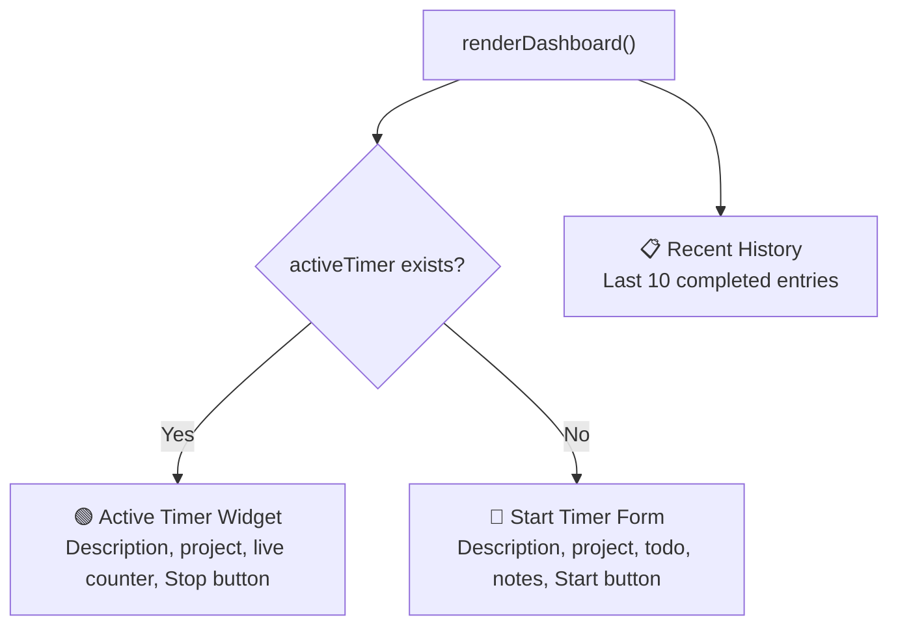
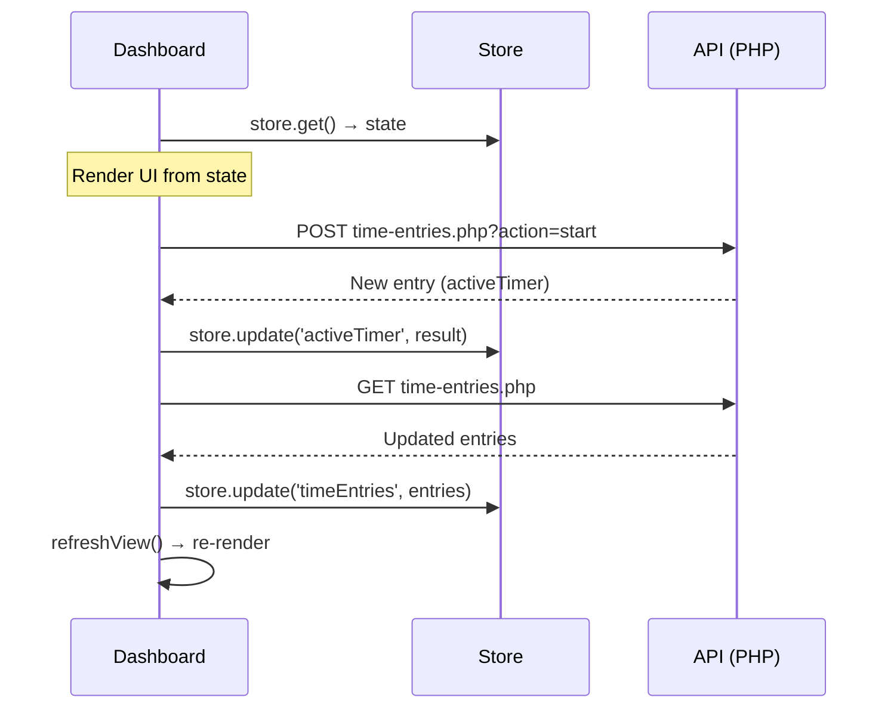
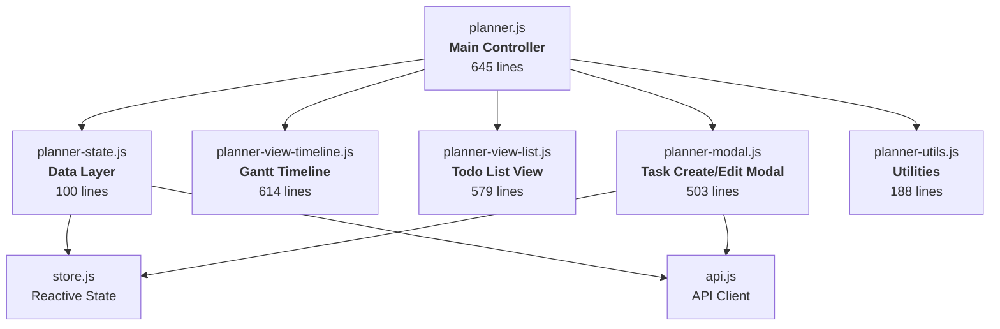
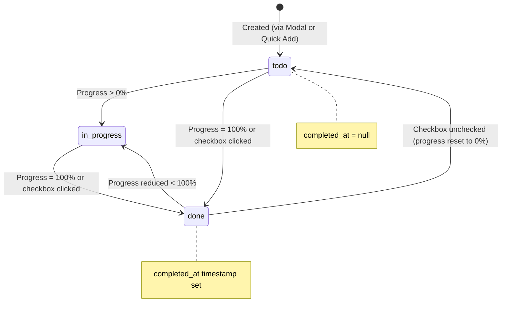
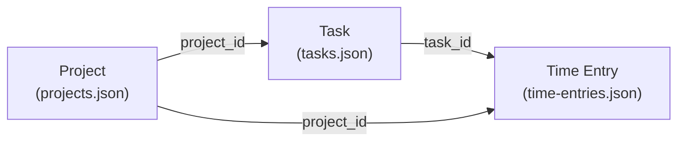

# Chat Conversation

Note: _This is purely the output of the chat conversation and does not contain any raw data, codebase snippets, etc. used to generate the output._

### User Input

Please tell me about this codde base.

### Planner Response

Let me explore the codebase to give you a solid overview.

*Listed directory [timeshark](file:///c:/laragon/www/timeshark)*

_Searched filesystem_

*Viewed [README.md](file:///c:/laragon/www/timeshark/README.md)*

*Listed directory [api](file:///c:/laragon/www/timeshark/api)*

*Listed directory [assets](file:///c:/laragon/www/timeshark/assets)*

*Analyzed [index.php](file:///c:/laragon/www/timeshark/index.php)*

*Listed directory [docs](file:///c:/laragon/www/timeshark/docs)*

*Listed directory [components](file:///c:/laragon/www/timeshark/assets/components)*

*Listed directory [utils](file:///c:/laragon/www/timeshark/assets/utils)*

*Analyzed [app.js](file:///c:/laragon/www/timeshark/assets/app.js)*

*Analyzed [store.php](file:///c:/laragon/www/timeshark/api/store.php)*

*Listed directory [planner](file:///c:/laragon/www/timeshark/assets/components/planner)*

### Planner Response

Here's a comprehensive overview of your **Time Shark** codebase:

---

## 🦈 Time Shark — Overview

**Time Shark** is a **single-page application (SPA)** for time tracking, built with a deliberately simple, no-build-step tech stack. It runs on **Laragon** locally at `http://timeshark.localhost`.

---

### Tech Stack

| Layer | Technology |
|---|---|
| **Frontend** | Vanilla JavaScript (ES Modules) |
| **Backend** | Vanilla PHP |
| **Styling** | Tailwind CSS (via CDN) + custom [style.css](cci:7://file:///c:/laragon/www/timeshark/assets/style.css:0:0-0:0) |
| **Charts** | Chart.js (vendored) |
| **Fonts** | Google Fonts (Outfit, Inter) |
| **Data Storage** | JSON files on disk (via [JsonStore](cci:2://file:///c:/laragon/www/timeshark/api/store.php:2:0-90:1) PHP class) |
| **Server** | Laragon (Apache/PHP) |

No frameworks, no npm, no build process. Refreshingly simple.

---

### Architecture

```
timeshark/
├── index.php              # SPA shell (sidebar, header, #app container)
├── assets/
│   ├── app.js             # Entry point: router, init, state bootstrap
│   ├── style.css          # Custom CSS (dark mode vars, animations)
│   ├── components/        # All view modules (ES Modules)
│   │   ├── dashboard.js   # Timer widget + recent time entries (33KB)
│   │   ├── projects.js    # Project CRUD + activity graphs (34KB)
│   │   ├── planner.js     # Task/todo planner entry point (33KB)
│   │   ├── planner/       # Planner sub-modules
│   │   │   ├── planner-modal.js
│   │   │   ├── planner-state.js
│   │   │   ├── planner-utils.js
│   │   │   ├── planner-view-list.js
│   │   │   └── planner-view-timeline.js
│   │   ├── organizations.js  # Client/customer management
│   │   ├── reports.js     # Reporting & analytics
│   │   ├── sidebar.js     # Navigation sidebar
│   │   └── team.js        # Team members/resources
│   ├── utils/
│   │   ├── api.js         # Fetch wrapper for API calls
│   │   └── store.js       # Simple reactive state store (pub/sub)
│   └── vendor/            # Chart.js
├── api/                   # PHP REST-ish API endpoints
│   ├── store.php          # JsonStore class (CRUD on JSON files)
│   ├── time-entries.php   # Start/stop/edit time entries
│   ├── projects.php       # Project CRUD
│   ├── organizations.php  # Client/customer CRUD
│   ├── planner.php        # Task/todo CRUD
│   ├── team.php           # Team member CRUD
│   └── debug.php          # Debug utility
├── data/                  # JSON data files (the "database")
├── docs/                  # Design/planning docs
└── logs/                  # App logs
```

---

### Key Concepts

1. **Hash-based Router** — [app.js](cci:7://file:///c:/laragon/www/timeshark/assets/app.js:0:0-0:0) maps URL hashes (`#projects`, `#planner`, etc.) to render functions. The default route (`''`) renders the **Dashboard**.

2. **Reactive State Store** — [utils/store.js](cci:7://file:///c:/laragon/www/timeshark/assets/utils/store.js:0:0-0:0) is a simple pub/sub store. On init, all data (organizations, projects, time entries, team, tasks) is fetched in parallel and set into the store. Components subscribe to state changes.

3. **JsonStore (Backend)** — [api/store.php](cci:7://file:///c:/laragon/www/timeshark/api/store.php:0:0-0:0) provides a [JsonStore](cci:2://file:///c:/laragon/www/timeshark/api/store.php:2:0-90:1) class with [get](cci:1://file:///c:/laragon/www/timeshark/api/store.php:16:4-24:5), [save](cci:1://file:///c:/laragon/www/timeshark/api/store.php:26:4-40:5), [find](cci:1://file:///c:/laragon/www/timeshark/api/store.php:42:4-50:5), [insert](cci:1://file:///c:/laragon/www/timeshark/api/store.php:52:4-60:5), [update](cci:1://file:///c:/laragon/www/timeshark/api/store.php:62:4-76:5), [delete](cci:1://file:///c:/laragon/www/timeshark/api/store.php:78:4-89:5) methods. Data is persisted as JSON files in `data/` with file-locking for atomic writes.

4. **Timer System** — The dashboard has a start/stop timer widget. An active timer is a time entry with no `end_time`. A persistent header ticker shows the running timer on non-dashboard pages.

5. **Client/Customer Hierarchy** — "Organizations" are companies; "Clients" are people. Projects can be assigned custodians from either.

6. **Planner** — A project planning/todo system with both a **list view** and a **timeline view** (Gantt-style). Tasks can be linked to time entries.

---

### Main Views

| Route | Component | Purpose |
|---|---|---|
| `#` (default) | [dashboard.js](cci:7://file:///c:/laragon/www/timeshark/assets/components/dashboard.js:0:0-0:0) | Start/stop timer, recent entries, quick logging |
| `#planner` | [planner.js](cci:7://file:///c:/laragon/www/timeshark/assets/components/planner.js:0:0-0:0) | Task/todo management, timeline planning |
| `#projects` | [projects.js](cci:7://file:///c:/laragon/www/timeshark/assets/components/projects.js:0:0-0:0) | Project CRUD, activity graphs, color-coded entries |
| `#organizations` | [organizations.js](cci:7://file:///c:/laragon/www/timeshark/assets/components/organizations.js:0:0-0:0) | Client & customer management |
| `#team` | [team.js](cci:7://file:///c:/laragon/www/timeshark/assets/components/team.js:0:0-0:0) | Team/resource management |
| `#reports` | [reports.js](cci:7://file:///c:/laragon/www/timeshark/assets/components/reports.js:0:0-0:0) | Analytics, filtering, reporting |

---

### Notable Patterns

- **All DOM rendering is imperative** — each component's `render()` function builds DOM elements with `document.createElement`, wires up event listeners, and returns a container node.
- **No templating engine** — everything is hand-built DOM or innerHTML strings.
- **Components are large** — [dashboard.js](cci:7://file:///c:/laragon/www/timeshark/assets/components/dashboard.js:0:0-0:0) is ~33KB, [projects.js](cci:7://file:///c:/laragon/www/timeshark/assets/components/projects.js:0:0-0:0) ~34KB. The planner is the biggest feature, split across 5 files totalling ~147KB.
- **Dark mode** — supported via Tailwind's `dark` class toggling.

This is a mature, feature-rich vanilla JS/PHP app with a clean separation between frontend components and backend JSON-file persistence. Want me to dive deeper into any specific area?

### User Input

Dig into the dashboard and how it works

### Planner Response

Let me read through the full dashboard component to give you a detailed breakdown.

*Analyzed [dashboard.js](file:///c:/laragon/www/timeshark/assets/components/dashboard.js)*

*Viewed [dashboard.js](file:///c:/laragon/www/timeshark/assets/components/dashboard.js)*

### Planner Response

Here's a deep dive into how [dashboard.js](cci:7://file:///c:/laragon/www/timeshark/assets/components/dashboard.js:0:0-0:0) works:

---

## 🦈 Dashboard — How It Works

The dashboard is the **default view** (hash route `''`) and serves as the primary interface for day-to-day time tracking. It's a single exported `async function renderDashboard()` (588 lines) that builds the entire view imperatively.

---

### Two Modes: Timer Running vs. Idle

The dashboard renders **completely different UI** depending on whether there's an active timer:



---

### 1. Start Timer Form (No Active Timer)

When idle, the dashboard shows a **two-row form**:

| Row | Contents |
|---|---|
| **Row 1** | Full-width description input + **Start** button |
| **Row 2** | 3-column grid: Project dropdown, Link Todo dropdown, Notes input |

**Smart behaviors:**

- **Project dropdown** groups projects into "Recent" (top 5 from recent time entries) and "All Projects"
- **Link Todo** dropdown dynamically populates with active (non-`done`) tasks for the selected project — updates on project change via [updateTodoOptions()](cci:1://file:///c:/laragon/www/timeshark/assets/components/dashboard.js:230:4-237:6) (line 231)
- **Auto-fill**: Selecting a todo auto-fills the description if it's empty (line 243-249)
- **Silent match**: On submit, if no todo is explicitly linked but the description exactly matches a task title (case-insensitive), it silently links it (lines 312-318)

**On submit** (`startForm.onsubmit`, line 302):

1. Reads form data via `FormData`
2. Resolves `project_name` from the selected project
3. Sets `resource_id` to the first team member's name (or `'Main'`)
4. Attempts silent todo matching
5. POSTs to `time-entries.php?action=start`
6. Updates the store and re-renders

---

### 2. Active Timer Widget (Timer Running)

When a timer is active, the form is replaced with:

- A **"Chomping"** status badge with project color
- The **task description** in large text
- The **project name** and optional notes
- A **live counter** (`00:00:00`) updated every second via `setInterval` (line 278-297)
- A red **Stop Tracking** button

**The counter is cleverly cleaned up**: A `MutationObserver` watches the DOM and clears the interval when the container is removed (line 290-296) — no memory leaks on navigation.

**Clicking the active task** opens an **Edit Current Task** modal (line 366-466) where you can modify the description, project, linked todo, start time, and notes while the timer is still running.

---

### 3. Recent History (Always Shown)

Below the timer widget/form, the last **10 completed entries** are displayed as cards, each showing:

- Color-shifted project accent bar
- Description + resource tag
- Project name (+ organization if linked)
- Linked todo badge (if applicable)
- Notes (if any)
- Time range + formatted duration
- **Resume** ▶ and **Delete** 🗑 action buttons

---

### 4. Modals (Edit Functionality)

Two edit modals are built inline within the function:

| Modal | Trigger | ID |
|---|---|---|
| **Edit Active Task** | Click the active task display | `#edit-active-form` |
| **Edit History Entry** | Click any history row (not buttons) | `#edit-history-form` |

Both modals:

- Render into `#modal-portal` (a fixed overlay div in [index.php](cci:7://file:///c:/laragon/www/timeshark/index.php:0:0-0:0))
- Have animated scale/opacity transitions
- Include a **Project ↔ Linked Todo** cascade (changing project re-populates the todo dropdown)
- Submit via `api.post('time-entries.php', data)` and refresh the view

The history modal also has **Start/End datetime-local inputs** for adjusting logged times.

---

### 5. Data Flow



**Key pattern**: Every action (start, stop, edit, delete, resume) follows the same cycle:

1. API call
2. Update store
3. Re-fetch time entries from backend
4. Full re-render via [refreshView()](cci:1://file:///c:/laragon/www/timeshark/assets/components/dashboard.js:261:2-265:4)

---

### 6. Helper Functions

| Function | Purpose |
|---|---|
| [formatDuration(secs)](cci:1://file:///c:/laragon/www/timeshark/assets/components/dashboard.js:24:2-29:4) | `→ "1h 23m 45s"` or `"23m 45s"` |
| [formatTime(dateStr)](cci:1://file:///c:/laragon/www/timeshark/assets/components/dashboard.js:31:2-35:4) | `→ "14:30"` (24h format) |
| [formatDateForInput(dateStr)](cci:1://file:///c:/laragon/www/timeshark/assets/components/dashboard.js:37:2-42:4) | `→ "2026-02-14T14:30"` for `datetime-local` inputs |
| [shiftColor(color, percent)](cci:1://file:///c:/laragon/www/timeshark/assets/components/dashboard.js:47:2-55:4) | Lightens/darkens a hex color — used for task accent bars |

---

### External Dependencies

The dashboard imports from the **Planner** subsystem:

- `PlannerModal` — renders and opens the task detail modal (used when clicking a linked todo on the active timer)
- `PlannerState` — initializes planner state if tasks aren't loaded yet

This means the dashboard is coupled to the planner for todo-linking functionality.

---

Want me to dig into any specific part more — like the API endpoints, the store, or the planner integration?

### User Input

Now dig into the planning page.

### Planner Response

Let me read through all the planner files — it's the largest feature in the app, split across 6 files.

*Analyzed [planner.js](file:///c:/laragon/www/timeshark/assets/components/planner.js)*

*Analyzed [planner-state.js](file:///c:/laragon/www/timeshark/assets/components/planner/planner-state.js)*

*Analyzed [planner-utils.js](file:///c:/laragon/www/timeshark/assets/components/planner/planner-utils.js)*

*Analyzed [planner-modal.js](file:///c:/laragon/www/timeshark/assets/components/planner/planner-modal.js)*

*Analyzed [planner-view-list.js](file:///c:/laragon/www/timeshark/assets/components/planner/planner-view-list.js)*

*Analyzed [planner-view-timeline.js](file:///c:/laragon/www/timeshark/assets/components/planner/planner-view-timeline.js)*

### Planner Response

Now let me read the key sections of the main controller and the views in more detail:

*Viewed [planner.js](file:///c:/laragon/www/timeshark/assets/components/planner.js)*

*Viewed [planner.js](file:///c:/laragon/www/timeshark/assets/components/planner.js)*

### Planner Response

Here's the full deep dive into the Planner:

---

## 📋 Planner — How It Works

The Planner is the biggest feature in Time Shark, split across **6 files totalling ~147KB**. It's a full project planning/todo system with two main views: a **Gantt-style timeline** and a **todo list**.

---

### Architecture Overview



---

### 1. Main Controller — [planner.js](cci:7://file:///c:/laragon/www/timeshark/assets/components/planner.js:0:0-0:0)

The controller manages **all state** and **all event handling** via module-level variables:

| Variable | Purpose | Default |
|---|---|---|
| `currentView` | `'timeline'` or `'list'` | `'timeline'` |
| `currentScale` | `'day'`, `'week'`, `'month'`, `'year'` | `'week'` |
| `currentZoom` | `'compact'`, `'regular'`, `'relaxed'` | `'regular'` |
| `timeOffset` | Navigation offset from today | `0` |
| `sidebarCollapsed` | Toggle sidebar visibility | `false` |
| `projectFilter` | `'all'` or a project ID | `'all'` |
| `sidebarCategory` | `'today'`, `'planned'`, `'completed'` | `'today'` |
| `listViewMode` | `'list'` or `'grid'` (persisted in localStorage) | `'list'` |

The core render loop is a single [updateUI()](cci:1://file:///c:/laragon/www/timeshark/assets/components/planner.js:184:4-327:6) function that:

1. Gets combined data from `PlannerState.getCombinedData(projectFilter)`
2. Generates a timeline config from `PlannerUtils.getTimelineConfig()`
3. Updates all toggle button states (view, scale, zoom, sidebar category)
4. Renders the **sidebar task list** via `PlannerList.render()`
5. Renders either the **timeline** or **full list view** depending on `currentView`

#### Layout Structure

```
┌──────────────────────────────────────────────────────────┐
│  Title: "Unified TODOs."                                 │
├──────────────────────────────────────────────────────────┤
│  Filter Bar:                                             │
│  [Timeline | Todo List]  [◄ Today ►]  "Feb 10 – Feb 23" │
│  [Project Filter ▼]     [day|week|month|year]            │
│                         [compact|regular|relaxed]        │
├────────────┬─────────────────────────────────────────────┤
│  SIDEBAR   │  MAIN CONTENT (Timeline or List)            │
│  ────────  │                                             │
│  ☀ Today   │  ┌─ Resource Row ─────────────────────────┐ │
│  📅 Planned │  │ [Project Lane] ▓▓▓▓░░░░ Task bars     │ │
│  ✓ Completed│  │ [Project Lane] ░░▓▓▓░░░               │ │
│  ────────  │  └────────────────────────────────────────┘ │
│  Task cards│  ┌─ Resource Row ─────────────────────────┐ │
│  ...       │  │ ...                                    │ │
│            │  └────────────────────────────────────────┘ │
└────────────┴─────────────────────────────────────────────┘
```

The sidebar is **hidden in list view** and **collapsible** (to 40px) in timeline view.

---

### 2. Data Layer — [planner-state.js](cci:7://file:///c:/laragon/www/timeshark/assets/components/planner/planner-state.js:0:0-0:0)

Small but critical. Two methods:

**[init()](cci:1://file:///c:/laragon/www/timeshark/assets/app.js:92:0-129:1)** — Fetches latest tasks + time entries from the API and updates the store.

**[getCombinedData(filterProjectId)](cci:1://file:///c:/laragon/www/timeshark/assets/components/planner/planner-state.js:26:4-97:5)** — The core data transform:

1. **Filters tasks** by project (or shows all)
2. **Splits tasks** into **Scheduled** (has `start_date`) vs **Backlog** (no start date)
   - Defaults unscheduled end dates to start + 30 minutes
3. **Builds resource rows** — maps team members to their tasks + time entries
   - Includes a `'General'` fallback resource
   - Filters out empty rows (no tasks, no entries)
4. Returns `{ rows, backlog, projects }`

---

### 3. Timeline View — [planner-view-timeline.js](cci:7://file:///c:/laragon/www/timeshark/assets/components/planner/planner-view-timeline.js:0:0-0:0)

The **Gantt chart**. This is the most complex renderer.

**Zoom presets** (`ZOOM` constant) define pixel dimensions per scale/zoom combination:

| Scale | Zoom | Column Width | Row Height | Bar Height |
|---|---|---|---|---|
| day | compact | 30px/col | 36px | 14px |
| day | regular | 60px/col | 48px | 22px |
| day | relaxed | 120px/col | 96px | 42px |
| week | compact | 30px/col | 36px | 14px |
| week | regular | 80px/col | 48px | 22px |
| year | compact | 14px/col | 36px | 14px |
| year | regular | 8px/col | 48px | 22px |

**Key rendering functions:**

- **[getX(date)](cci:1://file:///c:/laragon/www/timeshark/assets/components/planner/planner-view-timeline.js:80:8-85:10)** — Converts a date to an X pixel position on the timeline
- **[getWidth(start, end)](cci:1://file:///c:/laragon/www/timeshark/assets/components/planner/planner-view-timeline.js:87:8-92:10)** — Calculates a task bar's pixel width from its date range
- **[getProjectLanes(tasks)](cci:1://file:///c:/laragon/www/timeshark/assets/components/planner/planner-view-timeline.js:107:8-129:10)** — Groups tasks by project into **lanes** (swim lanes within a resource row). Each project gets its own horizontal lane, so tasks from different projects don't overlap visually.
- **[getProjectProgress(projectId)](cci:1://file:///c:/laragon/www/timeshark/assets/components/planner/planner-view-list.js:102:8-117:10)** — Computes aggregate progress across all tasks in a project (for "span" task bars that show project-level progress)
- **[isCompletedToday(t)](cci:1://file:///c:/laragon/www/timeshark/assets/components/planner/planner-view-list.js:26:8-35:10)** — Determines if a task was completed today (keeps it visible with 100% progress)

The timeline renders:

- **Column headers** (hours for day view, dates for week/month, months for year)
- **Today marker** (a vertical red/primary line)
- **Resource rows** with per-project lanes, each containing positioned task bars
- **Lane reordering** — Projects can be reordered within a resource row via a callback

---

### 4. List View — [planner-view-list.js](cci:7://file:///c:/laragon/www/timeshark/assets/components/planner/planner-view-list.js:0:0-0:0)

Renders tasks as cards in two modes: **list** (vertical) and **grid** (CSS grid). Used in both the **sidebar** (compact cards) and the **full list view** (full cards).

**Task categorization:**

| Category | Filter Logic |
|---|---|
| **Today** | Has a date range that intersects today, OR has no dates (backlog), AND not done (unless completed today) |
| **Planned** | Has a `start_date`, not done |
| **Completed** | `status === 'done'` |

**Two card types:**

- **Compact cards** (sidebar) — smaller, progress bar below content
- **Full cards** (main area) — larger with more detail, including time tracking info

**Completed tasks** support grouping by **week**, **month**, or **year** with pagination and a toggle to expand/collapse.

Each card shows:

- Project color badge
- Task title
- Priority indicator (low/medium/high/critical)
- Progress bar (clickable to cycle 0→25→50→75→100)
- Time tracked (from linked time entries)
- Status toggle checkbox
- "Track" button (starts a timer for this task)

---

### 5. Task Modal — [planner-modal.js](cci:7://file:///c:/laragon/www/timeshark/assets/components/planner/planner-modal.js:0:0-0:0)

A comprehensive task create/edit modal rendered into `#modal-portal`.

**Fields:**

- Title (required)
- Project (dropdown)
- Resource/Assignee (dropdown from team members)
- Priority (Low / Medium / High / Critical)
- Progress (0–100 slider + quick buttons for 0/25/50/75/100)
- Status (auto-derived: `todo` / `in-progress` / `done`)
- Schedule toggle (All Day / Timed)
  - Start Date + End Date
  - Start Time + End Time (when "Timed" is selected)
- Notes (textarea)
- Delete button (with confirmation)

**[open(task, defaults)](cci:1://file:///c:/laragon/www/timeshark/assets/components/planner/planner-modal.js:331:4-484:5)** — Opens in edit mode if `task` is provided, or create mode with optional `defaults`.

**[attachEvents()](cci:1://file:///c:/laragon/www/timeshark/assets/components/planner/planner-modal.js:154:4-329:5)** — Wires up all form interactions:

- Progress quick-buttons update the slider and vice versa
- Date toggle shows/hides time pickers
- Form submit creates (`POST planner.php`) or updates (`POST planner.php?action=update_task`)
- Delete triggers `DELETE planner.php?id=...`
- Calls `PlannerModal.onSave()` callback after save → triggers [refresh()](cci:1://file:///c:/laragon/www/timeshark/assets/components/planner.js:365:4-377:5) in the controller

---

### 6. Utilities — [planner-utils.js](cci:7://file:///c:/laragon/www/timeshark/assets/components/planner/planner-utils.js:0:0-0:0)

| Function | Purpose |
|---|---|
| [getContrastColor(hex)](cci:1://file:///c:/laragon/www/timeshark/assets/components/planner/planner-utils.js:7:4-15:5) | Returns `'text-white'` or `'text-slate-900'` for readability on colored backgrounds |
| [formatDuration(sec)](cci:1://file:///c:/laragon/www/timeshark/assets/components/planner/planner-utils.js:17:4-23:5) | `→ "2h 15m"` or `"45m"` |
| [shiftColor(color, percent)](cci:1://file:///c:/laragon/www/timeshark/assets/components/dashboard.js:47:2-55:4) | Lighten/darken hex colors |
| [toISODate(date)](cci:1://file:///c:/laragon/www/timeshark/assets/components/planner/planner-utils.js:36:4-39:5) | `→ "2026-02-14"` |
| [formatTime(date)](cci:1://file:///c:/laragon/www/timeshark/assets/components/dashboard.js:31:2-35:4) | `→ "14:30"` |
| [getWeekNum(d)](cci:1://file:///c:/laragon/www/timeshark/assets/components/planner/planner-utils.js:47:4-57:5) | ISO week number calculation |
| [getTimelineConfig(scale, offset, today)](cci:1://file:///c:/laragon/www/timeshark/assets/components/planner/planner-utils.js:59:4-185:5) | **Core** — generates the date grid, column widths, and total width for the timeline based on scale |

[getTimelineConfig](cci:1://file:///c:/laragon/www/timeshark/assets/components/planner/planner-utils.js:59:4-185:5) returns different configurations per scale:

- **Day**: 24 columns × 120px = 2880px total (one column per hour)
- **Week**: 14 columns × 80px = 1120px (2 weeks of days)
- **Month**: N columns × 30px (one column per day of the month)
- **Year**: 365 columns × 8px = 2920px (entire year, narrow)

---

### Event Handling Pattern

The controller uses **event delegation** — a single [click](cci:1://file:///c:/laragon/www/timeshark/assets/components/planner/planner-view-list.js:475:24-475:109) listener on the container handles _everything_ via `e.target.closest()`:

```
Click Event → closest('.toggle-status-btn')  → Toggle done/todo
           → closest('.track-btn')           → Start timer for task
           → closest('.inline-progress-bar') → Cycle progress 0→25→50→75→100
           → closest('.task-item/.task-bar')  → Open edit modal
           → closest('.nav-cat')             → Switch sidebar category
           → closest('.nav-btn')             → Navigate time (← Today →)
           → closest('.scale-toggle')        → Switch day/week/month/year
           → closest('.zoom-toggle')         → Switch compact/regular/relaxed
           → closest('.view-toggle')         → Switch timeline/list
           → closest('#toggle-sidebar-btn')  → Collapse/expand sidebar
           → closest('#sidebar-add-task')    → Open create modal
```

All actions use **optimistic updates** — the UI updates immediately, then the API call follows. On API failure, a full [refresh()](cci:1://file:///c:/laragon/www/timeshark/assets/components/planner.js:365:4-377:5) rolls back to server state.

---

### Integration with Dashboard

The planner is referenced from the dashboard in two ways:

1. The dashboard imports `PlannerModal` to let you click linked todos on active timer entries
2. The planner's "Track" button on tasks starts a timer and navigates to `#dashboard`

Want me to dig into any specific sub-component in more detail?

_Edited relevant file_

### User Input

Dig into TODOs and how they work

### Planner Response

Let me dig into the backend API and data model for TODOs/tasks.

*Viewed [planner.php](file:///c:/laragon/www/timeshark/api/planner.php)*

_Searched filesystem_

*Viewed [tasks.json](file:///c:/laragon/www/timeshark/data/tasks.json)*

*Viewed [planner-modal.js](file:///c:/laragon/www/timeshark/assets/components/planner/planner-modal.js)*

### Planner Response

Now let me also check how time entries link to tasks:

*Viewed [time-entries.php](file:///c:/laragon/www/timeshark/api/time-entries.php)*

### Planner Response

Here's the full deep dive into how **TODOs (Tasks)** work end-to-end:

---

## ✅ TODOs — How They Work

TODOs are called **"tasks"** internally. They're the core planning unit, persisted as JSON objects in [data/tasks.json](cci:7://file:///c:/laragon/www/timeshark/data/tasks.json:0:0-0:0) and managed through the [planner.php](cci:7://file:///c:/laragon/www/timeshark/api/planner.php:0:0-0:0) API.

---

### 1. Task Data Model

Every task is a flat JSON object. Here's the full schema derived from real data:

| Field | Type | Required | Description |
|---|---|---|---|
| [id](cci:1://file:///c:/laragon/www/timeshark/assets/components/planner/planner-view-timeline.js:87:8-92:10) | `string` | Auto-generated | `uniqid()` e.g. `"697874627caf2"` |
| `title` | `string` | ✅ Yes | The task description |
| `project_id` | `string` | Yes | Foreign key to [projects.json](cci:7://file:///c:/laragon/www/timeshark/data/projects.json:0:0-0:0) |
| `project_name` | `string` | No | Denormalized project name (convenience, not always present) |
| `resource_id` | `string` | Defaults to `"me"` | Team member assigned (e.g. `"Neels"`, `"General"`) |
| `status` | `string` | Defaults to `"todo"` | `"todo"` / `"in-progress"` / `"done"` |
| [progress](cci:1://file:///c:/laragon/www/timeshark/assets/components/planner/planner-view-list.js:126:8-126:134) | [int](cci:1://file:///c:/laragon/www/timeshark/assets/components/planner/planner-view-list.js:39:8-46:10) | Defaults to `0` | 0–100 percentage |
| `priority` | `string` | Defaults to `"low"` | `"low"` / `"medium"` / `"high"` |
| `task_type` | `string` | Defaults to `"task"` | `"task"` (normal) or `"project_span"` (milestone/epic bar) |
| `start_date` | `string\|null` | Defaults to today | ISO datetime, e.g. `"2026-02-14T09:00:00"` |
| `end_date` | `string\|null` | Defaults to today | ISO datetime |
| `start_time` | `string` | Frontend only | Used by modal, stripped before save |
| `end_time` | `string` | Frontend only | Used by modal, stripped before save |
| `notes` | `string` | No | Free-text notes |
| `completed_at` | `string\|null` | No | ISO timestamp of when task was marked done |
| `slots` | `string` | Legacy | Comma-separated hour slots (e.g. `"9,15"`) — legacy field |
| `continuous` | `bool` | No | Used with `project_span` to indicate ongoing work |

**Two task types:**

- **`task`** — A normal todo with its own progress bar (0–100%)
- **`project_span`** — A milestone/epic bar that spans across the timeline. Progress is **computed automatically** from all child tasks in the same project, not set manually.

---

### 2. Backend API — [planner.php](cci:7://file:///c:/laragon/www/timeshark/api/planner.php:0:0-0:0)

Simple REST-ish PHP endpoint backed by [JsonStore](cci:2://file:///c:/laragon/www/timeshark/api/store.php:2:0-90:1):

| Method | Action | Details |
|---|---|---|
| **GET** | List all tasks | Returns entire [tasks.json](cci:7://file:///c:/laragon/www/timeshark/data/tasks.json:0:0-0:0) array |
| **POST** (no [id](cci:1://file:///c:/laragon/www/timeshark/assets/components/planner/planner-view-timeline.js:87:8-92:10)) | Create task | Title required, defaults `resource_id` to `"me"`, dates to today |
| **POST** (with [id](cci:1://file:///c:/laragon/www/timeshark/assets/components/planner/planner-view-timeline.js:87:8-92:10)) | Update task | Merges fields via `array_merge`. Rejects blank titles |
| **DELETE** `?id=` | Delete task | Removes by ID |

**Validation rules:**

- Create: `title` is required, cannot be blank
- Update: if `title` is provided, it cannot be blank (but you can update other fields without sending `title`)
- Update: returns 404 if task ID doesn't exist

**No query parameter routing** — the API differentiates create vs. update by the presence of `data.id`. The `?action=update_task` query param on some frontend calls is actually ignored by the backend.

---

### 3. Task Lifecycle



**Status/progress auto-sync:**

- Setting progress to 100 → status auto-changes to `"done"`
- Setting progress below 100 when status is `"done"` → reverts to `"in-progress"` (or `"todo"` if 0)
- Toggling the checkbox sets progress to 100/0 accordingly

**`completed_at` logic:**

- When marked done, `completed_at` is set to:
  1. The task's `end_date` if it's in the past
  2. `now()` if no end date or end date is in the future
- When un-done, `completed_at` is set to `null`
- Once set, `completed_at` is preserved on re-saves (doesn't get overwritten)

---

### 4. Where Tasks Are Created

Tasks can be created from **three places**:

| Source | How | Defaults |
|---|---|---|
| **Sidebar "+" button** | Opens `PlannerModal.open(null, { start_date: today })` | Today's date |
| **Quick Add input** | Inline text input in the list view | Today's date, first project, first team member, `priority: "low"` |
| **Timeline click** | Opens modal with pre-filled date/resource | Clicked date + resource context |

---

### 5. How Tasks Connect to Time Tracking

Tasks are linked to time entries via `task_id`:



**Linking happens in three ways:**

1. **Explicit** — User selects a task from the "Link Todo" dropdown on the dashboard before starting a timer
2. **Silent match** — User types a description that exactly matches a task title in the selected project → auto-linked
3. **From planner** — Clicking the "Track" button on a task card starts a timer with `task_id` pre-set

When a time entry has a `task_id`, the dashboard shows a **"Linked Todo"** badge. The total time tracked per task is computed on-the-fly in the list view by summing durations of all time entries with matching `task_id`.

---

### 6. How Tasks Are Displayed

Tasks appear in **four contexts**, each filtering/rendering differently:

#### Sidebar (compact cards, category-filtered)

| Category | Shows |
|---|---|
| **Today** | Tasks whose date range intersects today + unscheduled backlog tasks (not done, unless completed today) |
| **Planned** | All tasks with a `start_date`, not done |
| **Completed** | All `status === "done"` tasks, grouped by week/month/year with pagination |

#### Full List View (expanded cards)

Shows **all tasks** (scheduled + backlog), with a **list/grid toggle**. Completed tasks are collapsible and grouped by time period.

#### Timeline (Gantt bars)

Only **scheduled tasks** (those with `start_date`) appear as horizontal bars. Positioned by date/time on the X-axis, grouped into per-project **lanes** within resource rows.

- **`task` type** → Normal colored bar with progress fill
- **`project_span` type** → Spanning bar with aggregate progress computed from all tasks in that project

#### Dashboard

Tasks appear indirectly as:

- Linked todo badges on time entries
- Todo dropdown options for linking

---

### 7. Task Edit Modal Details

The `PlannerModal` singleton manages all task CRUD UI:

**Form fields and their behavior:**

| Field | Behavior |
|---|---|
| **Title** | Required, text input |
| **Member** | Dropdown populated from [team.json](cci:7://file:///c:/laragon/www/timeshark/data/team.json:0:0-0:0) + `"General"` fallback |
| **Project** | Dropdown from [projects.json](cci:7://file:///c:/laragon/www/timeshark/data/projects.json:0:0-0:0) |
| **Status** | `todo` / `in-progress` / `done` — auto-synced with progress |
| **Type** | `task` or `project_span` — hides progress section for spans |
| **Priority** | `low` 🟢 / `medium` 🟡 / `high` 🔴 |
| **Notes** | Multi-line textarea |
| **Schedule toggle** | Enables/disables date fields; clearing toggle removes dates entirely |
| **Start/End Date + Time** | Separate date and time inputs; combined into ISO on save (`"2026-02-14T09:00:00"`) |
| **Progress** | Slider (0–100, step 5) + quick buttons (0/25/50/75/100); visual bar with color transitions (primary → emerald at 100%) |

**Save flow:**

1. Collects form data via `FormData`
2. Combines date + time into ISO strings (or nulls if schedule is off)
3. Ensures numeric progress
4. Sets `completed_at` appropriately
5. POSTs to [planner.php](cci:7://file:///c:/laragon/www/timeshark/api/planner.php:0:0-0:0) (backend differentiates create/update by presence of [id](cci:1://file:///c:/laragon/www/timeshark/assets/components/planner/planner-view-timeline.js:87:8-92:10))
6. Calls [onSave()](cci:1://file:///c:/laragon/www/timeshark/assets/components/planner/planner-modal.js:499:4-500:21) callback → triggers [refresh()](cci:1://file:///c:/laragon/www/timeshark/assets/components/planner.js:365:4-377:5) in the planner controller

---

### 8. Data Storage

Tasks live in [data/tasks.json](cci:7://file:///c:/laragon/www/timeshark/data/tasks.json:0:0-0:0) — a flat JSON array. Currently holds **35 tasks** (~16KB). The [JsonStore](cci:2://file:///c:/laragon/www/timeshark/api/store.php:2:0-90:1) class handles:

- Atomic writes with file locking (`flock`)
- Auto-generated IDs via PHP's `uniqid()`
- No indexing, no relations — everything is scanned linearly

Want me to dig into any other part of the system?

_Edited relevant file_

### User Input

Please evaluate how we can implement the TODO's feature better.  It feels a bit high friction.  I don't want to go to ANOTHER page to add todo's.  Addin Todos needs to be as natural and easy to to do as tracking my time!  I'm thinking todos should live between the timer start and time entry histor section on the dashboard.  I definitely want to get rid of the grid" view version of TODOs, it's just not adding any value and doesn't suit this feature.  I do like the TODO's sidebar on the planning page, but maybe to to the right?  Please grace me with your superior design knowledge and wisdom Claude.

*Viewed [dashboard.js](file:///c:/laragon/www/timeshark/assets/components/dashboard.js)*

### Planner Response

Now let me look at the current planner page more closely, particularly the sidebar and list view, to understand what we'd be bringing to the dashboard:

*Viewed [planner-view-list.js](file:///c:/laragon/www/timeshark/assets/components/planner/planner-view-list.js)*

*Viewed [planner.js](file:///c:/laragon/www/timeshark/assets/components/planner.js)*

### Planner Response

Now let me look at the planner's sidebar section and the remaining dashboard code to understand the full picture before designing the plan:

*Viewed [planner.js](file:///c:/laragon/www/timeshark/assets/components/planner.js)*

### Planner Response

Now I have a thorough understanding of the codebase. Let me check for existing tests:

_Searched filesystem_

_Searched filesystem_

### Planner Response

Now I have a complete picture. Let me write the implementation plan:

_Edited relevant file_

### User Input

I don't want to see completed or all project todos by default. By default I should only see TODAY (which includes overdue items and items completed today).  We should have a bar to the top/left/right (configurable?) where we can select if we want to see TODAY, PLANNED / BACKLOG, PROJECT SPANS and / or COMLETED items.  Maybe it should be a check button group so we can toggle any section on or off?  The font size of time and todo entries should be bigger in general than what the are at the moment.  We need to make our ddashboard items easy to read, even for old eyes.

### Planner Response

Let me also quickly check the current font sizes on the history entries to understand the baseline:

*Viewed [dashboard.js](file:///c:/laragon/www/timeshark/assets/components/dashboard.js)*

### Planner Response

Good — I can see the current font sizes. Now let me update the plan with all the user's feedback:

_Edited relevant file_

### User Input

### Planner Response

Plan approved — let's build it. I'll start with the task breakdown and then execute.

_Edited relevant file_
