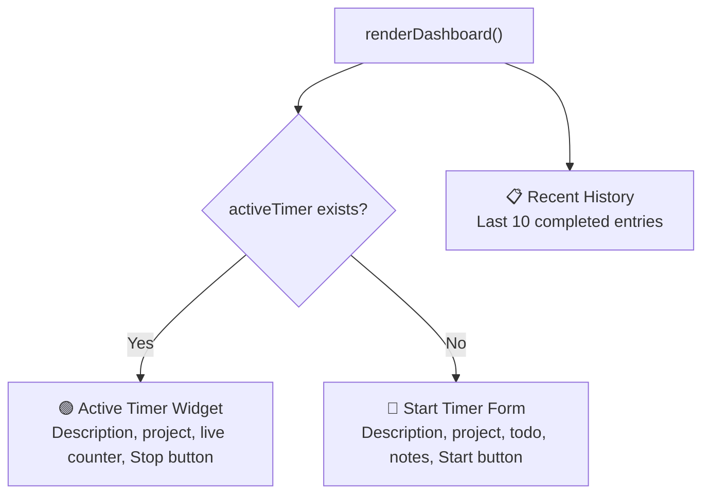
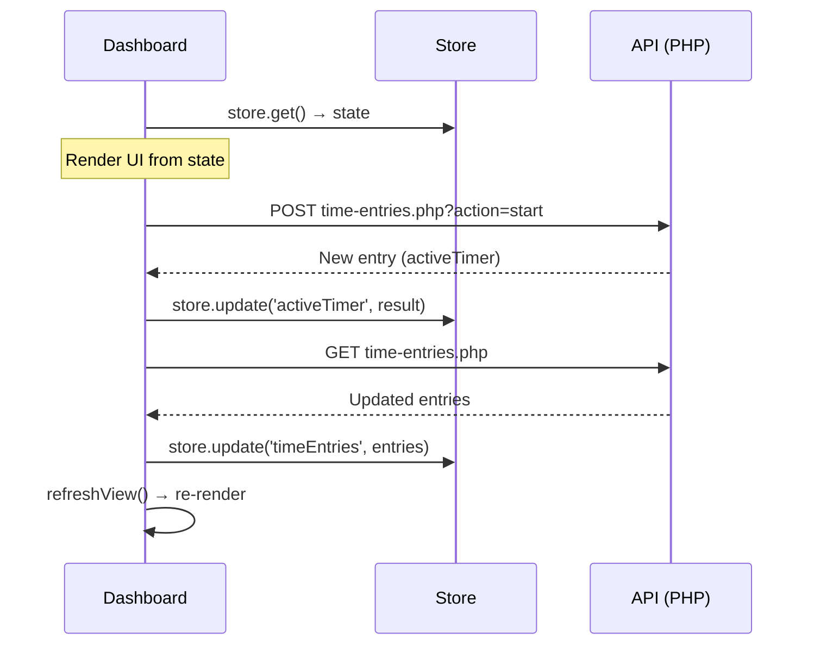

### User Input

Dig into the dashboard and how it works

### Planner Response

Let me read through the full dashboard component to give you a detailed breakdown.

*Analyzed [dashboard.js](file:///c:/laragon/www/timeshark/assets/components/dashboard.js)*

*Viewed [dashboard.js](file:///c:/laragon/www/timeshark/assets/components/dashboard.js)*

### Planner Response

Here's a deep dive into how [dashboard.js](cci:7://file:///c:/laragon/www/timeshark/assets/components/dashboard.js:0:0-0:0) works:

---

## 🦈 Dashboard — How It Works

The dashboard is the **default view** (hash route `''`) and serves as the primary interface for day-to-day time tracking. It's a single exported `async function renderDashboard()` (588 lines) that builds the entire view imperatively.

---

### Two Modes: Timer Running vs. Idle

The dashboard renders **completely different UI** depending on whether there's an active timer:

---

### 1. Start Timer Form (No Active Timer)

When idle, the dashboard shows a **two-row form**:

| Row | Contents |
|---|---|
| **Row 1** | Full-width description input + **Start** button |
| **Row 2** | 3-column grid: Project dropdown, Link Todo dropdown, Notes input |

**Smart behaviors:**

- **Project dropdown** groups projects into "Recent" (top 5 from recent time entries) and "All Projects"
- **Link Todo** dropdown dynamically populates with active (non-`done`) tasks for the selected project — updates on project change via [updateTodoOptions()](cci:1://file:///c:/laragon/www/timeshark/assets/components/dashboard.js:230:4-237:6) (line 231)
- **Auto-fill**: Selecting a todo auto-fills the description if it's empty (line 243-249)
- **Silent match**: On submit, if no todo is explicitly linked but the description exactly matches a task title (case-insensitive), it silently links it (lines 312-318)

**On submit** (`startForm.onsubmit`, line 302):

1. Reads form data via `FormData`
2. Resolves `project_name` from the selected project
3. Sets `resource_id` to the first team member's name (or `'Main'`)
4. Attempts silent todo matching
5. POSTs to `time-entries.php?action=start`
6. Updates the store and re-renders

---

### 2. Active Timer Widget (Timer Running)

When a timer is active, the form is replaced with:

- A **"Chomping"** status badge with project color
- The **task description** in large text
- The **project name** and optional notes
- A **live counter** (`00:00:00`) updated every second via `setInterval` (line 278-297)
- A red **Stop Tracking** button

**The counter is cleverly cleaned up**: A `MutationObserver` watches the DOM and clears the interval when the container is removed (line 290-296) — no memory leaks on navigation.

**Clicking the active task** opens an **Edit Current Task** modal (line 366-466) where you can modify the description, project, linked todo, start time, and notes while the timer is still running.

---

### 3. Recent History (Always Shown)

Below the timer widget/form, the last **10 completed entries** are displayed as cards, each showing:

- Color-shifted project accent bar
- Description + resource tag
- Project name (+ organization if linked)
- Linked todo badge (if applicable)
- Notes (if any)
- Time range + formatted duration
- **Resume** ▶ and **Delete** 🗑 action buttons

---

### 4. Modals (Edit Functionality)

Two edit modals are built inline within the function:

| Modal | Trigger | ID |
|---|---|---|
| **Edit Active Task** | Click the active task display | `#edit-active-form` |
| **Edit History Entry** | Click any history row (not buttons) | `#edit-history-form` |

Both modals:

- Render into `#modal-portal` (a fixed overlay div in [index.php](cci:7://file:///c:/laragon/www/timeshark/index.php:0:0-0:0))
- Have animated scale/opacity transitions
- Include a **Project ↔ Linked Todo** cascade (changing project re-populates the todo dropdown)
- Submit via `api.post('time-entries.php', data)` and refresh the view

The history modal also has **Start/End datetime-local inputs** for adjusting logged times.

---

### 5. Data Flow

**Key pattern**: Every action (start, stop, edit, delete, resume) follows the same cycle:

1. API call
2. Update store
3. Re-fetch time entries from backend
4. Full re-render via [refreshView()](cci:1://file:///c:/laragon/www/timeshark/assets/components/dashboard.js:261:2-265:4)

---

### 6. Helper Functions

| Function | Purpose |
|---|---|
| [formatDuration(secs)](cci:1://file:///c:/laragon/www/timeshark/assets/components/dashboard.js:24:2-29:4) | `→ "1h 23m 45s"` or `"23m 45s"` |
| [formatTime(dateStr)](cci:1://file:///c:/laragon/www/timeshark/assets/components/dashboard.js:31:2-35:4) | `→ "14:30"` (24h format) |
| [formatDateForInput(dateStr)](cci:1://file:///c:/laragon/www/timeshark/assets/components/dashboard.js:37:2-42:4) | `→ "2026-02-14T14:30"` for `datetime-local` inputs |
| [shiftColor(color, percent)](cci:1://file:///c:/laragon/www/timeshark/assets/components/dashboard.js:47:2-55:4) | Lightens/darkens a hex color — used for task accent bars |

---

### External Dependencies

The dashboard imports from the **Planner** subsystem:

- `PlannerModal` — renders and opens the task detail modal (used when clicking a linked todo on the active timer)
- `PlannerState` — initializes planner state if tasks aren't loaded yet

This means the dashboard is coupled to the planner for todo-linking functionality.
