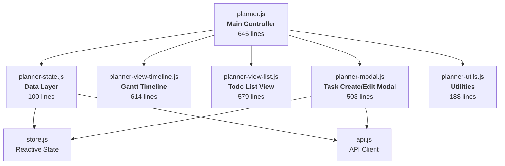

### User Input

Dig into the planning page and how it works.

### Planner Response

Let me read through all the planner files — it's the largest feature in the app, split across 6 files.

*Analyzed [planner.js](file:///c:/laragon/www/timeshark/assets/components/planner.js)*

*Analyzed [planner-state.js](file:///c:/laragon/www/timeshark/assets/components/planner/planner-state.js)*

*Analyzed [planner-utils.js](file:///c:/laragon/www/timeshark/assets/components/planner/planner-utils.js)*

*Analyzed [planner-modal.js](file:///c:/laragon/www/timeshark/assets/components/planner/planner-modal.js)*

*Analyzed [planner-view-list.js](file:///c:/laragon/www/timeshark/assets/components/planner/planner-view-list.js)*

*Analyzed [planner-view-timeline.js](file:///c:/laragon/www/timeshark/assets/components/planner/planner-view-timeline.js)*

### Planner Response

Now let me read the key sections of the main controller and the views in more detail:

*Viewed [planner.js](file:///c:/laragon/www/timeshark/assets/components/planner.js)*

*Viewed [planner.js](file:///c:/laragon/www/timeshark/assets/components/planner.js)*

### Planner Response

Here's the full deep dive into the Planner:

---

## 📋 Planner — How It Works

The Planner is the biggest feature in Time Shark, split across **6 files totalling ~147KB**. It's a full project planning/todo system with two main views: a **Gantt-style timeline** and a **todo list**.

---

### Architecture Overview



---

### 1. Main Controller — [planner.js](cci:7://file:///c:/laragon/www/timeshark/assets/components/planner.js:0:0-0:0)

The controller manages **all state** and **all event handling** via module-level variables:

| Variable | Purpose | Default |
|---|---|---|
| `currentView` | `'timeline'` or `'list'` | `'timeline'` |
| `currentScale` | `'day'`, `'week'`, `'month'`, `'year'` | `'week'` |
| `currentZoom` | `'compact'`, `'regular'`, `'relaxed'` | `'regular'` |
| `timeOffset` | Navigation offset from today | `0` |
| `sidebarCollapsed` | Toggle sidebar visibility | `false` |
| `projectFilter` | `'all'` or a project ID | `'all'` |
| `sidebarCategory` | `'today'`, `'planned'`, `'completed'` | `'today'` |
| `listViewMode` | `'list'` or `'grid'` (persisted in localStorage) | `'list'` |

The core render loop is a single [updateUI()](cci:1://file:///c:/laragon/www/timeshark/assets/components/planner.js:184:4-327:6) function that:

1. Gets combined data from `PlannerState.getCombinedData(projectFilter)`
2. Generates a timeline config from `PlannerUtils.getTimelineConfig()`
3. Updates all toggle button states (view, scale, zoom, sidebar category)
4. Renders the **sidebar task list** via `PlannerList.render()`
5. Renders either the **timeline** or **full list view** depending on `currentView`

#### Layout Structure

```
┌──────────────────────────────────────────────────────────┐
│  Title: "Unified TODOs."                                 │
├──────────────────────────────────────────────────────────┤
│  Filter Bar:                                             │
│  [Timeline | Todo List]  [◄ Today ►]  "Feb 10 – Feb 23" │
│  [Project Filter ▼]     [day|week|month|year]            │
│                         [compact|regular|relaxed]        │
├────────────┬─────────────────────────────────────────────┤
│  SIDEBAR   │  MAIN CONTENT (Timeline or List)            │
│  ────────  │                                             │
│  ☀ Today   │  ┌─ Resource Row ─────────────────────────┐ │
│  📅 Planned │  │ [Project Lane] ▓▓▓▓░░░░ Task bars     │ │
│  ✓ Completed│  │ [Project Lane] ░░▓▓▓░░░               │ │
│  ────────  │  └────────────────────────────────────────┘ │
│  Task cards│  ┌─ Resource Row ─────────────────────────┐ │
│  ...       │  │ ...                                    │ │
│            │  └────────────────────────────────────────┘ │
└────────────┴─────────────────────────────────────────────┘
```

The sidebar is **hidden in list view** and **collapsible** (to 40px) in timeline view.

---

### 2. Data Layer — [planner-state.js](cci:7://file:///c:/laragon/www/timeshark/assets/components/planner/planner-state.js:0:0-0:0)

Small but critical. Two methods:

**[init()](cci:1://file:///c:/laragon/www/timeshark/assets/app.js:92:0-129:1)** — Fetches latest tasks + time entries from the API and updates the store.

**[getCombinedData(filterProjectId)](cci:1://file:///c:/laragon/www/timeshark/assets/components/planner/planner-state.js:26:4-97:5)** — The core data transform:

1. **Filters tasks** by project (or shows all)
2. **Splits tasks** into **Scheduled** (has `start_date`) vs **Backlog** (no start date)
   - Defaults unscheduled end dates to start + 30 minutes
3. **Builds resource rows** — maps team members to their tasks + time entries
   - Includes a `'General'` fallback resource
   - Filters out empty rows (no tasks, no entries)
4. Returns `{ rows, backlog, projects }`

---

### 3. Timeline View — [planner-view-timeline.js](cci:7://file:///c:/laragon/www/timeshark/assets/components/planner/planner-view-timeline.js:0:0-0:0)

The **Gantt chart**. This is the most complex renderer.

**Zoom presets** (`ZOOM` constant) define pixel dimensions per scale/zoom combination:

| Scale | Zoom | Column Width | Row Height | Bar Height |
|---|---|---|---|---|
| day | compact | 30px/col | 36px | 14px |
| day | regular | 60px/col | 48px | 22px |
| day | relaxed | 120px/col | 96px | 42px |
| week | compact | 30px/col | 36px | 14px |
| week | regular | 80px/col | 48px | 22px |
| year | compact | 14px/col | 36px | 14px |
| year | regular | 8px/col | 48px | 22px |

**Key rendering functions:**

- **[getX(date)](cci:1://file:///c:/laragon/www/timeshark/assets/components/planner/planner-view-timeline.js:80:8-85:10)** — Converts a date to an X pixel position on the timeline
- **[getWidth(start, end)](cci:1://file:///c:/laragon/www/timeshark/assets/components/planner/planner-view-timeline.js:87:8-92:10)** — Calculates a task bar's pixel width from its date range
- **[getProjectLanes(tasks)](cci:1://file:///c:/laragon/www/timeshark/assets/components/planner/planner-view-timeline.js:107:8-129:10)** — Groups tasks by project into **lanes** (swim lanes within a resource row). Each project gets its own horizontal lane, so tasks from different projects don't overlap visually.
- **[getProjectProgress(projectId)](cci:1://file:///c:/laragon/www/timeshark/assets/components/planner/planner-view-list.js:102:8-117:10)** — Computes aggregate progress across all tasks in a project (for "span" task bars that show project-level progress)
- **[isCompletedToday(t)](cci:1://file:///c:/laragon/www/timeshark/assets/components/planner/planner-view-list.js:26:8-35:10)** — Determines if a task was completed today (keeps it visible with 100% progress)

The timeline renders:

- **Column headers** (hours for day view, dates for week/month, months for year)
- **Today marker** (a vertical red/primary line)
- **Resource rows** with per-project lanes, each containing positioned task bars
- **Lane reordering** — Projects can be reordered within a resource row via a callback

---

### 4. List View — [planner-view-list.js](cci:7://file:///c:/laragon/www/timeshark/assets/components/planner/planner-view-list.js:0:0-0:0)

Renders tasks as cards in two modes: **list** (vertical) and **grid** (CSS grid). Used in both the **sidebar** (compact cards) and the **full list view** (full cards).

**Task categorization:**

| Category | Filter Logic |
|---|---|
| **Today** | Has a date range that intersects today, OR has no dates (backlog), AND not done (unless completed today) |
| **Planned** | Has a `start_date`, not done |
| **Completed** | `status === 'done'` |

**Two card types:**

- **Compact cards** (sidebar) — smaller, progress bar below content
- **Full cards** (main area) — larger with more detail, including time tracking info

**Completed tasks** support grouping by **week**, **month**, or **year** with pagination and a toggle to expand/collapse.

Each card shows:

- Project color badge
- Task title
- Priority indicator (low/medium/high/critical)
- Progress bar (clickable to cycle 0→25→50→75→100)
- Time tracked (from linked time entries)
- Status toggle checkbox
- "Track" button (starts a timer for this task)

---

### 5. Task Modal — [planner-modal.js](cci:7://file:///c:/laragon/www/timeshark/assets/components/planner/planner-modal.js:0:0-0:0)

A comprehensive task create/edit modal rendered into `#modal-portal`.

**Fields:**

- Title (required)
- Project (dropdown)
- Resource/Assignee (dropdown from team members)
- Priority (Low / Medium / High / Critical)
- Progress (0–100 slider + quick buttons for 0/25/50/75/100)
- Status (auto-derived: `todo` / `in-progress` / `done`)
- Schedule toggle (All Day / Timed)
  - Start Date + End Date
  - Start Time + End Time (when "Timed" is selected)
- Notes (textarea)
- Delete button (with confirmation)

**[open(task, defaults)](cci:1://file:///c:/laragon/www/timeshark/assets/components/planner/planner-modal.js:331:4-484:5)** — Opens in edit mode if `task` is provided, or create mode with optional `defaults`.

**[attachEvents()](cci:1://file:///c:/laragon/www/timeshark/assets/components/planner/planner-modal.js:154:4-329:5)** — Wires up all form interactions:

- Progress quick-buttons update the slider and vice versa
- Date toggle shows/hides time pickers
- Form submit creates (`POST planner.php`) or updates (`POST planner.php?action=update_task`)
- Delete triggers `DELETE planner.php?id=...`
- Calls `PlannerModal.onSave()` callback after save → triggers [refresh()](cci:1://file:///c:/laragon/www/timeshark/assets/components/planner.js:365:4-377:5) in the controller

---

### 6. Utilities — [planner-utils.js](cci:7://file:///c:/laragon/www/timeshark/assets/components/planner/planner-utils.js:0:0-0:0)

| Function | Purpose |
|---|---|
| [getContrastColor(hex)](cci:1://file:///c:/laragon/www/timeshark/assets/components/planner/planner-utils.js:7:4-15:5) | Returns `'text-white'` or `'text-slate-900'` for readability on colored backgrounds |
| [formatDuration(sec)](cci:1://file:///c:/laragon/www/timeshark/assets/components/planner/planner-utils.js:17:4-23:5) | `→ "2h 15m"` or `"45m"` |
| [shiftColor(color, percent)](cci:1://file:///c:/laragon/www/timeshark/assets/components/dashboard.js:47:2-55:4) | Lighten/darken hex colors |
| [toISODate(date)](cci:1://file:///c:/laragon/www/timeshark/assets/components/planner/planner-utils.js:36:4-39:5) | `→ "2026-02-14"` |
| [formatTime(date)](cci:1://file:///c:/laragon/www/timeshark/assets/components/dashboard.js:31:2-35:4) | `→ "14:30"` |
| [getWeekNum(d)](cci:1://file:///c:/laragon/www/timeshark/assets/components/planner/planner-utils.js:47:4-57:5) | ISO week number calculation |
| [getTimelineConfig(scale, offset, today)](cci:1://file:///c:/laragon/www/timeshark/assets/components/planner/planner-utils.js:59:4-185:5) | **Core** — generates the date grid, column widths, and total width for the timeline based on scale |

[getTimelineConfig](cci:1://file:///c:/laragon/www/timeshark/assets/components/planner/planner-utils.js:59:4-185:5) returns different configurations per scale:

- **Day**: 24 columns × 120px = 2880px total (one column per hour)
- **Week**: 14 columns × 80px = 1120px (2 weeks of days)
- **Month**: N columns × 30px (one column per day of the month)
- **Year**: 365 columns × 8px = 2920px (entire year, narrow)

---

### Event Handling Pattern

The controller uses **event delegation** — a single [click](cci:1://file:///c:/laragon/www/timeshark/assets/components/planner/planner-view-list.js:475:24-475:109) listener on the container handles *everything* via `e.target.closest()`:

```
Click Event → closest('.toggle-status-btn')  → Toggle done/todo
           → closest('.track-btn')           → Start timer for task
           → closest('.inline-progress-bar') → Cycle progress 0→25→50→75→100
           → closest('.task-item/.task-bar')  → Open edit modal
           → closest('.nav-cat')             → Switch sidebar category
           → closest('.nav-btn')             → Navigate time (← Today →)
           → closest('.scale-toggle')        → Switch day/week/month/year
           → closest('.zoom-toggle')         → Switch compact/regular/relaxed
           → closest('.view-toggle')         → Switch timeline/list
           → closest('#toggle-sidebar-btn')  → Collapse/expand sidebar
           → closest('#sidebar-add-task')    → Open create modal
```

All actions use **optimistic updates** — the UI updates immediately, then the API call follows. On API failure, a full [refresh()](cci:1://file:///c:/laragon/www/timeshark/assets/components/planner.js:365:4-377:5) rolls back to server state.

---

### Integration with Dashboard

The planner is referenced from the dashboard in two ways:

1. The dashboard imports `PlannerModal` to let you click linked todos on active timer entries
2. The planner's "Track" button on tasks starts a timer and navigates to `#dashboard`
