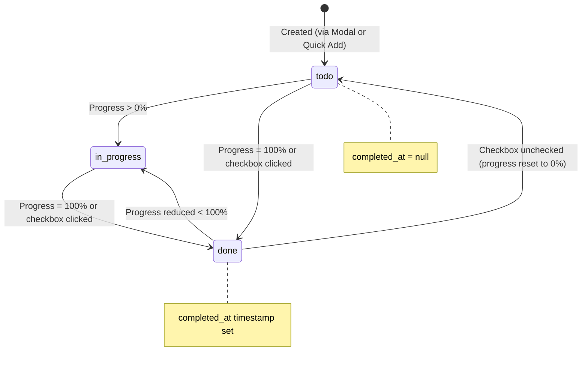
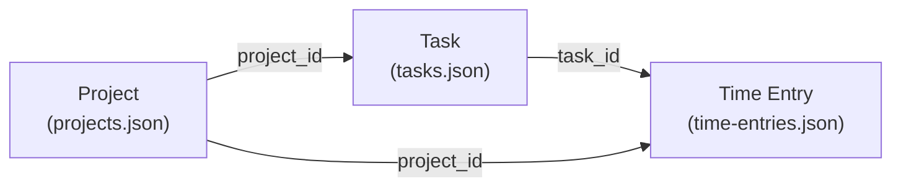

### User Input

Dig into TODOs and how they work

### Planner Response

Let me dig into the backend API and data model for TODOs/tasks.

*Viewed [planner.php](file:///c:/laragon/www/timeshark/api/planner.php)*

*Searched filesystem*

*Viewed [tasks.json](file:///c:/laragon/www/timeshark/data/tasks.json)*

*Viewed [planner-modal.js](file:///c:/laragon/www/timeshark/assets/components/planner/planner-modal.js)*

### Planner Response

Now let me also check how time entries link to tasks:

*Viewed [time-entries.php](file:///c:/laragon/www/timeshark/api/time-entries.php)*

### Planner Response

Here's the full deep dive into how **TODOs (Tasks)** work end-to-end:

---

## ✅ TODOs — How They Work

TODOs are called **"tasks"** internally. They're the core planning unit, persisted as JSON objects in [data/tasks.json](cci:7://file:///c:/laragon/www/timeshark/data/tasks.json:0:0-0:0) and managed through the [planner.php](cci:7://file:///c:/laragon/www/timeshark/api/planner.php:0:0-0:0) API.

---

### 1. Task Data Model

Every task is a flat JSON object. Here's the full schema derived from real data:

| Field | Type | Required | Description |
|---|---|---|---|
| [id](cci:1://file:///c:/laragon/www/timeshark/assets/components/planner/planner-view-timeline.js:87:8-92:10) | `string` | Auto-generated | `uniqid()` e.g. `"697874627caf2"` |
| `title` | `string` | ✅ Yes | The task description |
| `project_id` | `string` | Yes | Foreign key to [projects.json](cci:7://file:///c:/laragon/www/timeshark/data/projects.json:0:0-0:0) |
| `project_name` | `string` | No | Denormalized project name (convenience, not always present) |
| `resource_id` | `string` | Defaults to `"me"` | Team member assigned (e.g. `"Neels"`, `"General"`) |
| `status` | `string` | Defaults to `"todo"` | `"todo"` / `"in-progress"` / `"done"` |
| [progress](cci:1://file:///c:/laragon/www/timeshark/assets/components/planner/planner-view-list.js:126:8-126:134) | [int](cci:1://file:///c:/laragon/www/timeshark/assets/components/planner/planner-view-list.js:39:8-46:10) | Defaults to `0` | 0–100 percentage |
| `priority` | `string` | Defaults to `"low"` | `"low"` / `"medium"` / `"high"` |
| `task_type` | `string` | Defaults to `"task"` | `"task"` (normal) or `"project_span"` (milestone/epic bar) |
| `start_date` | `string\|null` | Defaults to today | ISO datetime, e.g. `"2026-02-14T09:00:00"` |
| `end_date` | `string\|null` | Defaults to today | ISO datetime |
| `start_time` | `string` | Frontend only | Used by modal, stripped before save |
| `end_time` | `string` | Frontend only | Used by modal, stripped before save |
| `notes` | `string` | No | Free-text notes |
| `completed_at` | `string\|null` | No | ISO timestamp of when task was marked done |
| `slots` | `string` | Legacy | Comma-separated hour slots (e.g. `"9,15"`) — legacy field |
| `continuous` | `bool` | No | Used with `project_span` to indicate ongoing work |

**Two task types:**

- **`task`** — A normal todo with its own progress bar (0–100%)
- **`project_span`** — A milestone/epic bar that spans across the timeline. Progress is **computed automatically** from all child tasks in the same project, not set manually.

---

### 2. Backend API — [planner.php](cci:7://file:///c:/laragon/www/timeshark/api/planner.php:0:0-0:0)

Simple REST-ish PHP endpoint backed by [JsonStore](cci:2://file:///c:/laragon/www/timeshark/api/store.php:2:0-90:1):

| Method | Action | Details |
|---|---|---|
| **GET** | List all tasks | Returns entire [tasks.json](cci:7://file:///c:/laragon/www/timeshark/data/tasks.json:0:0-0:0) array |
| **POST** (no [id](cci:1://file:///c:/laragon/www/timeshark/assets/components/planner/planner-view-timeline.js:87:8-92:10)) | Create task | Title required, defaults `resource_id` to `"me"`, dates to today |
| **POST** (with [id](cci:1://file:///c:/laragon/www/timeshark/assets/components/planner/planner-view-timeline.js:87:8-92:10)) | Update task | Merges fields via `array_merge`. Rejects blank titles |
| **DELETE** `?id=` | Delete task | Removes by ID |

**Validation rules:**

- Create: `title` is required, cannot be blank
- Update: if `title` is provided, it cannot be blank (but you can update other fields without sending `title`)
- Update: returns 404 if task ID doesn't exist

**No query parameter routing** — the API differentiates create vs. update by the presence of `data.id`. The `?action=update_task` query param on some frontend calls is actually ignored by the backend.

---

### 3. Task Lifecycle

**Status/progress auto-sync:**

- Setting progress to 100 → status auto-changes to `"done"`
- Setting progress below 100 when status is `"done"` → reverts to `"in-progress"` (or `"todo"` if 0)
- Toggling the checkbox sets progress to 100/0 accordingly

**`completed_at` logic:**

- When marked done, `completed_at` is set to:
  1. The task's `end_date` if it's in the past
  2. `now()` if no end date or end date is in the future
- When un-done, `completed_at` is set to `null`
- Once set, `completed_at` is preserved on re-saves (doesn't get overwritten)

---

### 4. Where Tasks Are Created

Tasks can be created from **three places**:

| Source | How | Defaults |
|---|---|---|
| **Sidebar "+" button** | Opens `PlannerModal.open(null, { start_date: today })` | Today's date |
| **Quick Add input** | Inline text input in the list view | Today's date, first project, first team member, `priority: "low"` |
| **Timeline click** | Opens modal with pre-filled date/resource | Clicked date + resource context |

---

### 5. How Tasks Connect to Time Tracking

Tasks are linked to time entries via `task_id`:

**Linking happens in three ways:**

1. **Explicit** — User selects a task from the "Link Todo" dropdown on the dashboard before starting a timer
2. **Silent match** — User types a description that exactly matches a task title in the selected project → auto-linked
3. **From planner** — Clicking the "Track" button on a task card starts a timer with `task_id` pre-set

When a time entry has a `task_id`, the dashboard shows a **"Linked Todo"** badge. The total time tracked per task is computed on-the-fly in the list view by summing durations of all time entries with matching `task_id`.

---

### 6. How Tasks Are Displayed

Tasks appear in **four contexts**, each filtering/rendering differently:

#### Sidebar (compact cards, category-filtered)

| Category | Shows |
|---|---|
| **Today** | Tasks whose date range intersects today + unscheduled backlog tasks (not done, unless completed today) |
| **Planned** | All tasks with a `start_date`, not done |
| **Completed** | All `status === "done"` tasks, grouped by week/month/year with pagination |

#### Full List View (expanded cards)

Shows **all tasks** (scheduled + backlog), with a **list/grid toggle**. Completed tasks are collapsible and grouped by time period.

#### Timeline (Gantt bars)

Only **scheduled tasks** (those with `start_date`) appear as horizontal bars. Positioned by date/time on the X-axis, grouped into per-project **lanes** within resource rows.

- **`task` type** → Normal colored bar with progress fill
- **`project_span` type** → Spanning bar with aggregate progress computed from all tasks in that project

#### Dashboard

Tasks appear indirectly as:

- Linked todo badges on time entries
- Todo dropdown options for linking

---

### 7. Task Edit Modal Details

The `PlannerModal` singleton manages all task CRUD UI:

**Form fields and their behavior:**

| Field | Behavior |
|---|---|
| **Title** | Required, text input |
| **Member** | Dropdown populated from [team.json](cci:7://file:///c:/laragon/www/timeshark/data/team.json:0:0-0:0) + `"General"` fallback |
| **Project** | Dropdown from [projects.json](cci:7://file:///c:/laragon/www/timeshark/data/projects.json:0:0-0:0) |
| **Status** | `todo` / `in-progress` / `done` — auto-synced with progress |
| **Type** | `task` or `project_span` — hides progress section for spans |
| **Priority** | `low` 🟢 / `medium` 🟡 / `high` 🔴 |
| **Notes** | Multi-line textarea |
| **Schedule toggle** | Enables/disables date fields; clearing toggle removes dates entirely |
| **Start/End Date + Time** | Separate date and time inputs; combined into ISO on save (`"2026-02-14T09:00:00"`) |
| **Progress** | Slider (0–100, step 5) + quick buttons (0/25/50/75/100); visual bar with color transitions (primary → emerald at 100%) |

**Save flow:**

1. Collects form data via `FormData`
2. Combines date + time into ISO strings (or nulls if schedule is off)
3. Ensures numeric progress
4. Sets `completed_at` appropriately
5. POSTs to [planner.php](cci:7://file:///c:/laragon/www/timeshark/api/planner.php:0:0-0:0) (backend differentiates create/update by presence of [id](cci:1://file:///c:/laragon/www/timeshark/assets/components/planner/planner-view-timeline.js:87:8-92:10))
6. Calls [onSave()](cci:1://file:///c:/laragon/www/timeshark/assets/components/planner/planner-modal.js:499:4-500:21) callback → triggers [refresh()](cci:1://file:///c:/laragon/www/timeshark/assets/components/planner.js:365:4-377:5) in the planner controller

---

### 8. Data Storage

Tasks live in [data/tasks.json](cci:7://file:///c:/laragon/www/timeshark/data/tasks.json:0:0-0:0) — a flat JSON array. Currently holds **35 tasks** (~16KB). The [JsonStore](cci:2://file:///c:/laragon/www/timeshark/api/store.php:2:0-90:1) class handles:

- Atomic writes with file locking (`flock`)
- Auto-generated IDs via PHP's `uniqid()`
- No indexing, no relations — everything is scanned linearly
