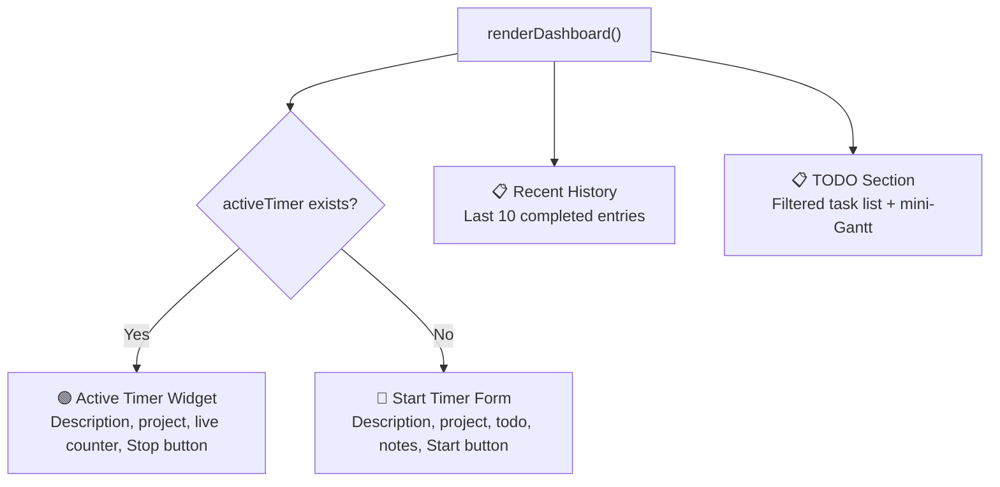
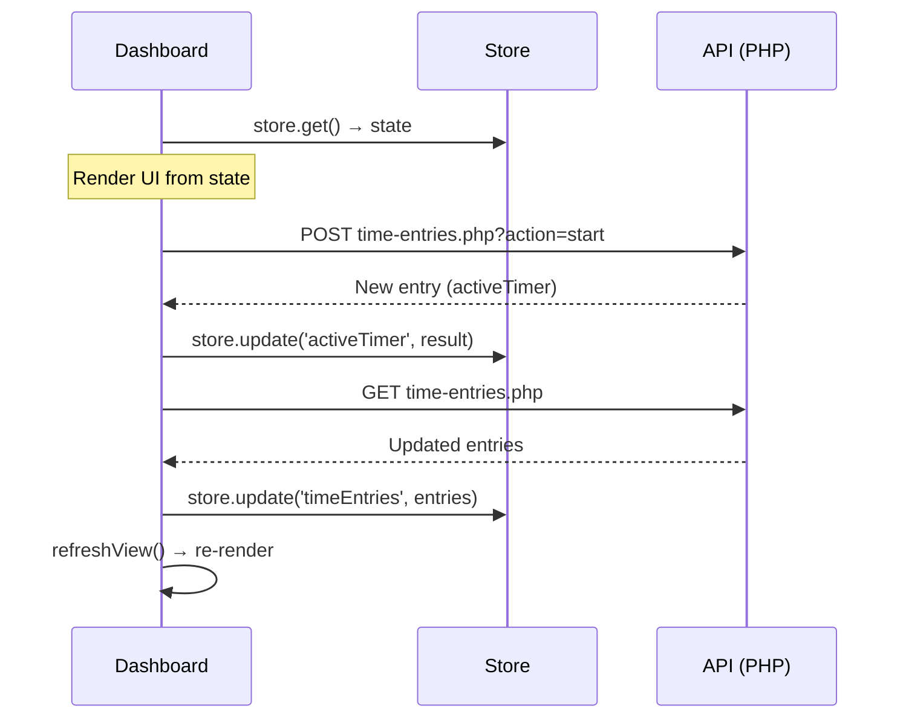

### User Input

Dig into the dashboard and how it works

### Planner Response

Let me read through the full dashboard component to give you a detailed breakdown.

*Analyzed [dashboard.js](file:///c:/laragon/www/timeshark/components/dashboard.js)*

*Viewed [dashboard.js](file:///c:/laragon/www/timeshark/components/dashboard.js)*

### Planner Response

Here's a deep dive into how [dashboard.js](cci:7://file:///c:/laragon/www/timeshark/components/dashboard.js:0:0-0:0) works:

---

## 🦈 Dashboard — How It Works

The dashboard is the **default view** (hash route `''`) and serves as the primary interface for day-to-day time tracking. It's a single exported `async function renderDashboard()` (1000+ lines) that builds the entire view imperatively.

---

### Two Modes: Timer Running vs. Idle

The dashboard renders **completely different UI** depending on whether there's an active timer:



---

### 1. Start Timer Form (No Active Timer)

When idle, the dashboard shows a **two-row form**:

| Row | Contents |
|---|---|
| **Row 1** | Full-width description input + **Start** button |
| **Row 2** | 3-column grid: Project dropdown, Link Todo dropdown, Notes input |

**Smart behaviors:**

- **Project dropdown** groups projects into "Recent" (top 5 from recent time entries) and "All Projects"
- **Link Todo** dropdown dynamically populates with active (non-`done`) tasks for the selected project — updates on project change via [updateTodoOptions()](cci:1://file:///c:/laragon/www/timeshark/components/dashboard.js:239:4-246:6) (line 239)
- **Auto-fill**: Selecting a todo auto-fills the description if it's empty (line 251-257)
- **Silent match**: On submit, if no todo is explicitly linked but the description exactly matches a task title (case-insensitive), it silently links it (lines 733-740)

**On submit** (`startForm.onsubmit`, line 723):

1. Reads form data via `FormData`
2. Resolves `project_name` from the selected project
3. Sets `resource_id` to the first team member's name (or `'Main'`)
4. Attempts silent todo matching
5. POSTs to `time-entries.php?action=start`
6. Updates the store and re-renders

---

### 2. Active Timer Widget (Timer Running)

When a timer is active, the form is replaced with:

- A **"Chomping"** status badge with project color
- The **task description** in large text
- The **project name** and optional notes
- A **live counter** (`00:00:00`) updated every second via `setInterval` (line 696-718)
- A red **Stop Tracking** button

**The counter is cleverly cleaned up**: A `MutationObserver` watches the DOM and clears the interval when the container is removed (line 711-717) — no memory leaks on navigation.

**Clicking the active task** opens an **Edit Current Task** modal (line 787-884) where you can modify the description, project, linked todo, start time, and notes while the timer is still running.

---

### 3. TODO Section with Task Filters

Below the timer widget, there's a filterable task list with 4 toggle buttons:

| Filter | Icon | Purpose |
|---|---|---|
| **Today** | ☀ | Tasks intersecting today's date or unscheduled |
| **Completed** | ✓ | Tasks with `status: 'done'` |
| **Planned** | 📅 | Scheduled tasks not intersecting today |
| **Projects** | ▓ | Project span tasks (shows mini-Gantt chart) |

Filter state persists in `localStorage` as `dashboard_task_filters`.

**Task List Rendering** (lines 298-381):

- Uses `PlannerList.render()` from the planner subsystem
- Displays compact task cards with progress bars
- Click a task to open `PlannerModal` for editing
- Quick-add input creates tasks for most recent project

---

### 4. Project Spans Mini-Gantt Chart

When the **Projects** filter is active, a **mini-Gantt chart** replaces the task list (lines 383-539).

**Purpose**: Visualizes all project timelines in a compact horizontal bar chart:

- Each project has a span task (`task_type: 'project_span'`) that represents the project timeline
- Bars are color-coded to project colors
- Shows progress percentage calculated from **all non-span tasks** in that project
- "Today" indicator with red vertical line
- Month tick marks for time context

**Progress Calculation** (lines 452-459):

```javascript
const progress = (s) => {
  // Find all tasks for this project (excluding spans)
  const allProjectTasks = allTasks.filter(t =>
    String(t.project_id) === String(s.project_id) && t.task_type !== 'project_span'
  );
  if (allProjectTasks.length === 0) return 0;
  // Average progress of all tasks
  const totalProgress = allProjectTasks.reduce((sum, t) => sum + (t.progress || 0), 0);
  return Math.round(totalProgress / allProjectTasks.length);
};
```

**Visual Features**:

- Horizontal bars with project color + opacity for background
- Progress fill overlay (opacity 0.5)
- Past projects are dimmed (opacity-40)
- Current projects (start ≤ today ≤ end) have shadow emphasis
- Click any span to open `PlannerModal` for editing dates

**Relationship to Span Tasks**:
> **Note:** Span tasks and projects are now bidirectionally synchronized. Editing span task dates/progress automatically updates the parent project, and vice versa. The dashboard displays the synced project progress field. See [walkthrough](file:///C:/Users/xavie/.gemini/antigravity/brain/11b4e2d2-d7a0-4028-adc0-f75a94ff481f/walkthrough.md) for implementation details.

---

### 5. Recent History (Always Shown)

Below the TODO section, the last **10 completed entries** are displayed as cards, each showing:

- Color-shifted project accent bar
- Description + resource tag
- Project name (+ organization if linked)
- Linked todo badge (if applicable)
- Notes (if any)
- Time range + formatted duration
- **Resume** ▶ and **Delete** 🗑 action buttons

---

### 6. Modals (Edit Functionality)

Two edit modals are built inline within the function:

| Modal | Trigger | ID |
|---|---|---|
| **Edit Active Task** | Click the active task display | `#edit-active-form` |
| **Edit History Entry** | Click any history row (not buttons) | `#edit-history-form` |

Both modals:

- Render into `#modal-portal` (a fixed overlay div in [index.php](cci:7://file:///c:/laragon/www/timeshark/index.php:0:0-0:0))
- Have animated scale/opacity transitions
- Include a **Project ↔ Linked Todo** cascade (changing project re-populates the todo dropdown)
- Submit via `api.post('time-entries.php', data)` and refresh the view

The history modal also has **Start/End datetime-local inputs** for adjusting logged times.

---

### 7. Data Flow



**Key pattern**: Every action (start, stop, edit, delete, resume) follows the same cycle:

1. API call
2. Update store
3. Re-fetch time entries from backend
4. Full re-render via [refreshView()](cci:1://file:///c:/laragon/www/timeshark/components/dashboard.js:270:2-274:4)

---

### 8. Helper Functions

| Function | Purpose |
|---|---|
| [formatDuration(secs)](cci:1://file:///c:/laragon/www/timeshark/components/dashboard.js:27:2-32:4) | `→ "1h 23m 45s"` or `"23m 45s"` |
| [formatTime(dateStr)](cci:1://file:///c:/laragon/www/timeshark/components/dashboard.js:34:2-38:4) | `→ "14:30"` (24h format) |
| [formatDateForInput(dateStr)](cci:1://file:///c:/laragon/www/timeshark/components/dashboard.js:40:2-45:4) | `→ "2026-02-14T14:30"` for `datetime-local` inputs |
| [shiftColor(color, percent)](cci:1://file:///c:/laragon/www/timeshark/components/dashboard.js:50:2-58:4) | Lightens/darkens a hex color — used for task accent bars |

---

### 9. External Dependencies

The dashboard imports from the **Planner** subsystem:

- `PlannerModal` — renders and opens the task detail modal (used when clicking a linked todo on the active timer)
- `PlannerState` — initializes planner state if tasks aren't loaded yet
- `PlannerList` — renders the filtered task list in the TODO section

This means the dashboard is coupled to the planner for todo-linking functionality.
